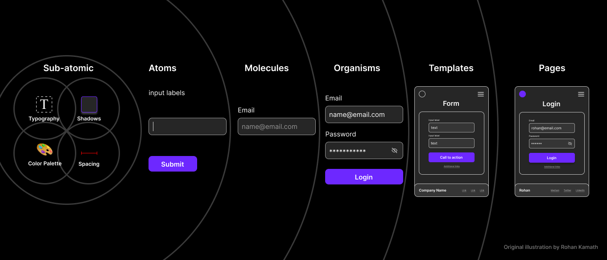
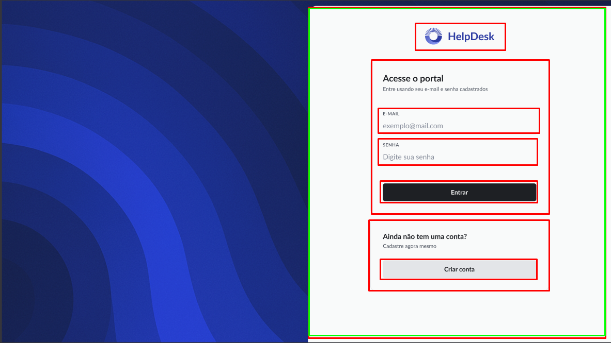

<p align="center">
  
</p>

## Importante! recomendo a criação dos atomos com o seguinte comando:

```bash
npx ng g c shared/components/atoms/nome-do-atomo --standalone --inline-style --skip-tests --inline-template --export
```
Isso já exporta o componente para ser usado, e cria apenas um .ts com tudo centralizado

Remova "--inline-template" caso precisar do .html

## Explicação da técnica:

Componentes do angular material são sub-atomicos

Modificar um item de lá o torna um atomo

Seguiremos a estrutura abaixo para criar os elementos de forma organizada:

```bash
shared/
  components/
    templates/
```

Quando for começar a criação sua página faça marcações em volta dos elementos que serão inseridos na página em que estiver trabalhando:

<p align="center">
  
</p>

Vamos usar apenas o template
Siga o figma: [Disponível aqui](https://www.figma.com/design/l2FOk4gyBZ939U3bBxKoRu/WEB2)

Com todos esses imports você precisará colocar o template dentro da page, e a page dentro do router, como child do Layout correto. Acessar a subrota definida para a page te dará acesso a um desenvolvimento "ao vivo" de todas as mudanças que fizer nos componentes.

Vai ficar fácil de gerenciar cada um dos pequenos objetos, você pode reutilizar pequenos componentes, e os templates/organismos nunca são compartilhados entre elementos, o que reduz a necessidade de merges depois, pois atomos são feitos apenas uma vez.