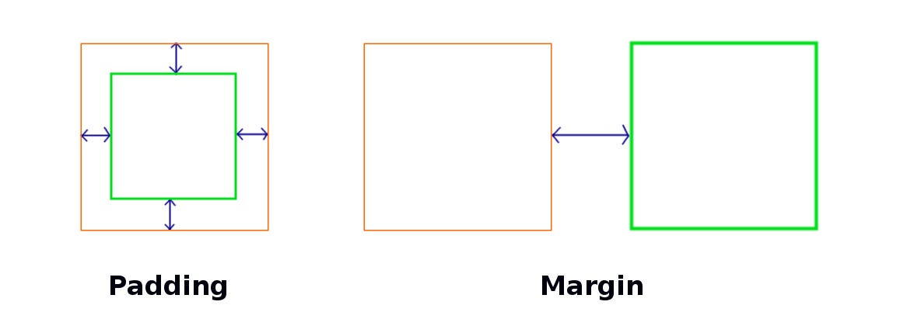

## Dicas gerais de css

Para consistência no design é interessante usar multiplos de 4 nas medidas

Se o figma mostra 7px de espaçamento, prefira usar 8px.

O tailwind usa medidas prontas com multiplicador 4

```html
<div class="p-1"><!-- ... --></div>
```

Isso gera um padding de 4 pixels em todas as direções, (top, right, bottom, left)

Se precisar de valores específicos e não quiser dividir usando "p-0.5" por exemplo (o que é recomendado) você pode usar:

```html
<div class="p-[41px]"><!-- ... --></div>
```

Quando usar padding/margin/gap?

<p align="start">
  
</p>

<p align="start">
  
</p>

Simples: quando tiver 2 elementos apenas para espaçar (input + label) pode usar margin (idealmente mt, margin top no tailwind, aplicado ao elemento de baixo)

Quando tiver uma lista de 3 ou mais elementos dentro de uma div unica, já separe eles por gap no elemento pai

Padding é para dar uma área de respiro para todos os elementos internos, para que haja um espaço em branco entre a border (linha do componente) e o texto dentro por exemplo, dando legibilidade para os componentes.

## Variantes de Padding, Margin e Gap

Padding em todas as direções simultaneamente, no eixo x ou y, ou individualmente escolhendo uma direção
```html
<div class="p-1 px-1 py-1 pt-1 pr-1 pl-1 pb-1"><!-- ... --></div>
```

Margin em todas as direções simultaneamente, no eixo x ou y, ou individualmente escolhendo uma direção

É mais provavel que você use apenas mt e ml (sempre no segundo elemento, afastando ele do anterior)
```html
<div class="m-1 mx-1 my-1 mt-1 mr-1 ml-1 mb-1"><!-- ... --></div>
```
Gap em todas as direções ou em eixos específicos.

```html
<div class="gap-1 gap-x-2 gap-y-2"><!-- ... --></div>
```

## Trabalhando com cores

No nosso trabalho vamos padronizar as cores do projeto usando "@theme" do tailwind css

Como fazer, alterar e consultar?

[Customizar um tema](https://v3.tailwindcss.com/docs/theme)

[Como usar cores (geral)](https://v3.tailwindcss.com/docs/customizing-colors)

Vou usar como exemplo cores que já existem:

<p align="start">
  
</p>

Para setar a cor no tom desejado:

```html
<div class="bg-sky-900"></div>
```

Para adicionar opacidade (de 10 em 10 de variação até 100% ou com % definida):
```html
<div class="text-pink-500/30 bg-pink-500/[71.37%]"><!-- ... --></div>
```

Como usar as cores:

| Utilitário       | Descrição                                                                            |
| ---------------- | ------------------------------------------------------------------------------------ |
| `bg-*`           | Define a **cor de fundo** do elemento.                                               |
| `text-*`         | Define a **cor do texto** do elemento.                                               |
| `decoration-*`   | Define a **cor da decoração do texto** (ex.: sublinhado).                            |
| `border-*`       | Define a **cor da borda** do elemento.                                               |
| `outline-*`      | Define a **cor do outline** (contorno de foco).                                      |
| `shadow-*`       | Define a **cor das sombras** (*box-shadow*).                                         |
| `inset-shadow-*` | Define a **cor das sombras internas** (*inset box-shadow*).                          |
| `ring-*`         | Define a **cor dos anéis (rings)** de foco/realce.                                   |
| `inset-ring-*`   | Define a **cor dos anéis internos** (*inset ring*).                                  |
| `accent-*`       | Define a **cor de destaque** dos **controles de formulário** (ex.: checkbox, radio). |
| `caret-*`        | Define a **cor do cursor de texto** (*caret*) em campos de formulário.               |
| `fill-*`         | Define a **cor de preenchimento** (*fill*) de elementos **SVG**.                     |
| `stroke-*`       | Define a **cor do traço** (*stroke*) de elementos **SVG**.                           |